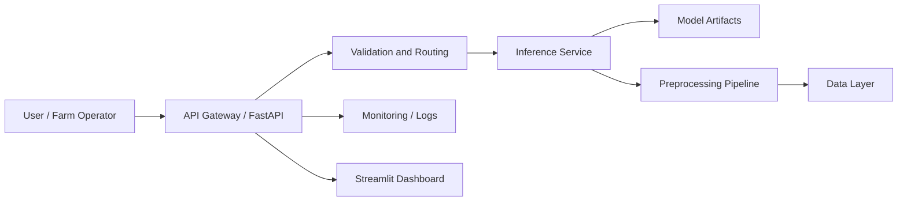

# AgriGuard


AgriGuard is a production-oriented Crop Health and Precision Agriculture System designed to help growers, agronomists, and operations teams detect plant stress early, monitor crop conditions, and support data-driven field decisions.

The repository is scaffolded for a FastAPI backend, AI model assets, reproducible data workflows, experiments, and containerized deployment. It is intentionally structured to scale from a prototype into a maintainable engineering system.

## Why this project?

Precision agriculture depends on timely, reliable decisions in environments where crop stress, disease, and environmental variation can change rapidly. AgriGuard is designed to support that reality by combining computer vision, structured data processing, and API-driven inference in a clean production architecture.

From an engineering perspective, this project is valuable because it exercises several real-world system design concerns at once:

- High-impact domain problem with direct operational value
- Model-backed backend services that must be maintainable and testable
- Separation of inference, configuration, and API concerns
- Containerized delivery for reproducible development and deployment
- A structure that can evolve from local experimentation to production workflows

## Overview

AgriGuard combines computer vision, agronomic data processing, and API-driven delivery to support crop monitoring workflows such as:

- Crop health classification
- Disease and stress detection
- Image-based field diagnostics
- Data ingestion and preprocessing
- Model inference via API
- Dashboard-friendly backend services

The codebase is organized so engineering teams can separate concerns cleanly:

- `app/` contains the FastAPI application and service layer
- `models/` stores trained model artifacts and model metadata
- `data/` stores datasets, feature outputs, and intermediate artifacts
- `notebooks/` contains exploratory analysis and research notebooks
- `docker/` holds deployment helpers and container-related documentation
- `tests/` contains automated tests for API and service behavior

## Technical Highlights

- FastAPI-first backend architecture for high-performance HTTP APIs
- Modular application layout for maintainability and team ownership
- Clear separation between inference logic, API routes, and configuration
- Container-ready design with Python 3.10 support
- Test scaffold included from day one for regression protection
- Documentation-oriented repository structure suitable for production handoff

## Tech Stack

- Python 3.10
- FastAPI
- Uvicorn
- PyTorch
- Torchvision
- Pandas
- NumPy
- Streamlit
- python-dotenv

## System Architecture



> Diagram placeholder: replace this with the final architecture view once model serving, data storage, and observability choices are finalized.

## Repository Structure

```text
AgriGuard/
  app/
    api/
    core/
    schemas/
    services/
    main.py
  data/
  docker/
  models/
  notebooks/
  tests/
  Dockerfile
  LICENSE
  README.md
  requirements.txt
```

## Engineering Trade-offs

### 1. FastAPI over a heavier framework
FastAPI gives us speed, type hints, and a clean developer experience. The trade-off is that some enterprise features must be composed deliberately rather than inherited from a monolithic platform.

### 2. File-based model artifacts in the repo scaffold
Keeping `models/` as a dedicated directory makes local experimentation straightforward. The trade-off is that large production artifacts should eventually move to object storage or a model registry.

### 3. Lightweight initial dependency set
This scaffold intentionally starts with a focused dependency list. The trade-off is that observability, authentication, background jobs, and CI tooling can be introduced incrementally based on product maturity.

### 4. API and inference separated by design
Separating web routing from model logic improves testability and maintainability. The trade-off is a slightly larger initial code surface, which is worthwhile for long-term team scaling.

## Quality Strategy

- Unit tests for route and service behavior
- Input validation at the API boundary
- Explicit configuration management via environment variables
- Modular code that is easy to mock and extend
- Container-based runtime parity between development and production

## API Examples

### Root

```http
GET /
```

Response:

```json
{
  "message": "AgriGuard API is running",
  "docs": "/docs",
  "health": "/health"
}
```

### Health

```http
GET /health
```

Response:

```json
{
  "status": "ok",
  "service": "ready"
}
```

## Getting Started

### 1. Create and activate a virtual environment

```bash
python -m venv .venv
```

Activate it:

```bash
.venv\Scripts\activate
```

### 2. Install dependencies

```bash
pip install -r requirements.txt
```

### 3. Start the API locally

```bash
uvicorn app.main:app --reload
```

### 4. Open the service

- API root: `http://127.0.0.1:8000/`
- Interactive docs: `http://127.0.0.1:8000/docs`
- Alternative OpenAPI spec: `http://127.0.0.1:8000/redoc`

## Project Status

AgriGuard is currently structured as a production-ready scaffold with a working FastAPI foundation, a test harness, and container support. The repository is ready for iterative expansion into model serving, data persistence, and agronomic analytics.

## Testing

Run the test suite with:

```bash
pytest
```

## Docker

AgriGuard ships with a Python 3.10 optimized Dockerfile for repeatable builds and production-aligned runtime behavior.

### 1. Build the image

```bash
docker build -t agriguard .
```

### 2. Run the container

```bash
docker run --rm -p 8000:8000 agriguard
```

### 3. Verify the deployment

- Health endpoint: `http://127.0.0.1:8000/health`
- Docs: `http://127.0.0.1:8000/docs`

### 4. Production considerations

- Mount persistent volumes for model artifacts and generated outputs
- Pass environment variables for runtime configuration
- Add orchestration, secrets management, and observability before production rollout

## Future Roadmap

- Add real crop disease inference pipelines
- Introduce experiment tracking and model versioning
- Add authentication and role-based access control
- Persist predictions and field observations in a database
- Add geospatial and satellite imagery support
- Add a Streamlit dashboard for agronomists and field teams
- Introduce CI/CD, linting, formatting, and release automation
- Add observability with structured logs, metrics, and tracing

## Contributing

This repository is structured to support collaborative development. Keep changes modular, documented, and test-backed. Prefer small, reviewable pull requests with clear scope.

## Deployment Notes

- Keep model weights out of the application image when they are expected to change independently
- Promote trained artifacts through a model registry or versioned storage layer
- Add CI/CD validation before any production deployment
- Extend the API with authentication, request throttling, and structured logging as the platform matures

## License

This project is licensed under the MIT License. See the `LICENSE` file for details.
